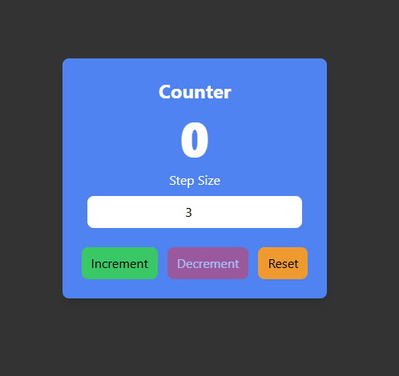

# 🚀 React Counter App

A simple and interactive **Counter App** built with **React + Vite + TailwindCSS**.  
This app allows you to increment, decrement, and reset a counter with a custom step size. It also prevents values from going below `0` or above `100` with warning messages.

---

## ✨ Features

- ➕ **Increment** the counter by a custom step size.

- ➖ **Decrement** the counter safely (no negative values).

- 🔄 **Reset** the counter back to zero.

- ⚠️ Warning messages when:
  - Trying to exceed the maximum value (`100`).
  - Trying to go below the minimum value (`0`).

- 🎨 Styled with **TailwindCSS** for a clean and modern UI.

---

## 📸 Demo UI

<p align="center">
  
</p>

---

## 🛠️ Tech Stack

- **React** (with Hooks)

- **Vite** (for fast development & build)

- **TailwindCSS** (for styling)


---

### 🚦 Getting Started

---

### 1️⃣ Clone the Repository

```bash
git clone https://github.com/SaqiiCoditz/React-Projects.git

cd Counter_App

2️⃣ Install Dependencies

npm install

 3️⃣ Run Development Server

npm run dev

4️⃣ Build for Production
npm run build
```
---

### ⚙️ Usage

Enter a step size (default is 1).

Click Increment or Decrement to change the counter.

Use Reset to set the counter back to 0.

Counter value will always remain between 0 and 100.


---


### 📜 License

This project is open-source and free to use under the MIT License
.